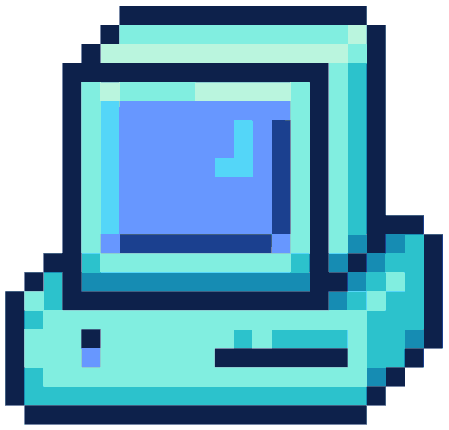
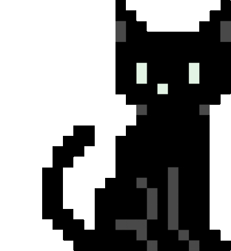

# Hey there! I'm Javier Diaz 

<table>
    <tr>
        <td>
            
        </td>
        <td>
            I'm a systems engineer based in Colombia 🇨🇴. I enjoy creating end-to-end solutions, understanding complex systems, and telling stories with data.
        </td>
    </tr>
</table>

### What I'm Up To 
Currently, I'm diving into event-driven architecture, real-time systems, and learning more about advanced data analytics.

### Tools I like 
Everyone has their favorite tools. These are the ones I enjoy working with the most.
<table>
    <tr>
        <td valign="top">
            <h4>Interfaces & UX</h4>
            <ul>
                <li>React</li>
                <li>TypeScript</li>
                <li>TailwindCSS</li>
                <li>Figma</li>
            </ul>
        </td>
        <td valign="top">
            <h4>APIs & Systems</h4>
            <ul>
                <li>Python</li>
                <li>FastAPI</li>
                <li>WebSockets</li>
                <li>Supabase</li>
            </ul>
        </td>
        <td valign="top">
            <h4>Data & Visualization</h4>
            <ul>
                <li>SQL</li>
                <li>Power BI</li>
                <li>Tableau</li>
            </ul>
        </td>
    </tr>
</table>

### A little about me 
- Mario Mendoza is my favorite Colombian writer
- There's a good chance I'm listening to Tøp or Black Dresses on repeat right now
- I use Arch btw 🤭

### Contact me 
If you'd like to get in touch, feel free to reach out on LinkedIn. Always open to connecting, collaborating, or just chatting about tech.

### Made it this far? Why not take a look at my pinned projects? 
